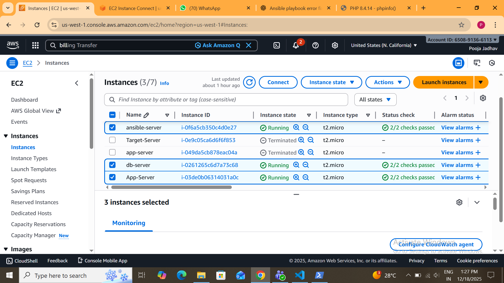
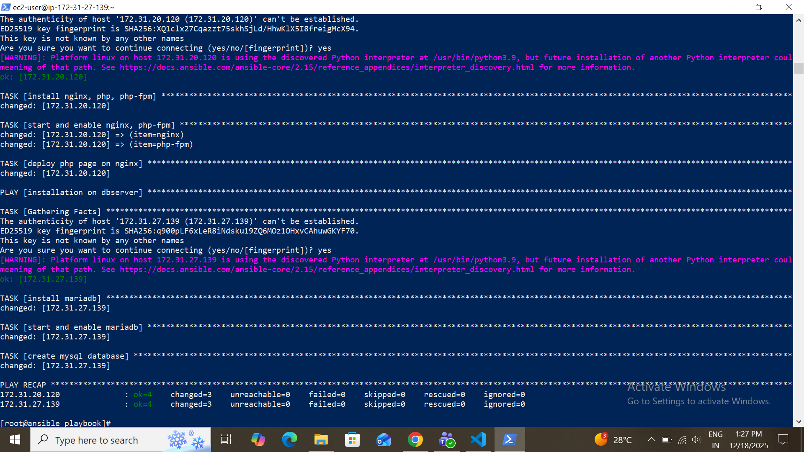

# 2-Tier-Architecture-Project-Using-Ansible-With-Inventory-
## Introduction

This project showcases the automated deployment of a 2-Tier application architecture using Ansible configuration management and an inventory-based host setup.

The goal of this project is to eliminate manual server configuration by using Infrastructure as Code (IaC) principles and deploy a complete web + database environment in a single Ansible playbook executio

## Architecture Overview

A 2-Tier Architecture separates the application logic and data layer into two independent servers:

### 1. Application Tier

- Hosts the web application

- Handles client requests

Technologies used:

- Nginx

- PHP

- PHP-FPM

### 2. Database Tier

- Responsible for data storage

- Runs independently from the application layer

 Technology used:

 -    MariaDB

All servers are managed centrally using Ansible Inventory.

## Technologies & Tools

- Ansible

- YAML

- Inventory File

- Nginx Web Server

- PHP & PHP-FPM

- MariaDB

- Linux (Amazon Linux / RHEL)

## Project Structure

     2-Tier-Architecture-Project-Using-Ansible-With-Inventory/
      │
      ├── inventory.ini
      ├── 2-tier.yml
      ├── README.md
      └── Img/
      ├── Instances.png
      ├── apptier-output.png
      └── database-output.png
      |_2-tier-architecture

## Inventory Configuration

The inventory file defines multiple host groups to manage different tiers.

     [appserver]
     <application_server_private_ip>

     [dbserver]
     <database_server_private_ip>

- Private IPs are used to maintain secure internal communication.

## Deployment Steps
### Step 1: Verify Host Connectivity

      ansible -i inventory.ini 

### Step 2: Execute Ansible Playbook
      
    ansible-playbook 2-tier.yml -i inventory.ini 

#### The playbook performs:

- Package installation

- Service configuration and startup

- PHP application deployment

- Database installation and creation

## Output Screenshots

### 1. EC2 Instances:
 
 Create a three EC2 Instances such as ansible-server, app-server, db-server

 

 ### 2. Run The Ansible Playbook Or Inventory File

 

 ### 3. Final Output

 

 ### 4. Database Output

 

 ## Validation

- Web server successfully serves PHP application

- PHP-FPM is running and integrated with Nginx

- MariaDB service is active

- Database is created successfully

- Entire setup completed without manual intervention

## Key Highlights

- Fully automated 2-Tier deployment

- Single playbook for multiple servers

- Clean separation of application and database layers

- Inventory-based host management

- Real-world DevOps automation workflow

## Learnings & Skills
-  Experience with Ansible Playbooks

- Practical understanding of 2-Tier Architecture

- Server orchestration using Inventory files

- Service management and configuration automation

- Infrastructure as Code best practices

## Conclusion 
This project demonstrates how Ansible can be effectively used to deploy scalable and maintainable architectures.
By automating repetitive tasks, it reduces configuration errors and improves deployment efficiency — a core requirement in modern DevOps environments.

## Author

Pooja Jadhav

Aspiring DevOps Engineer | Cloud & Automation Enthusiast